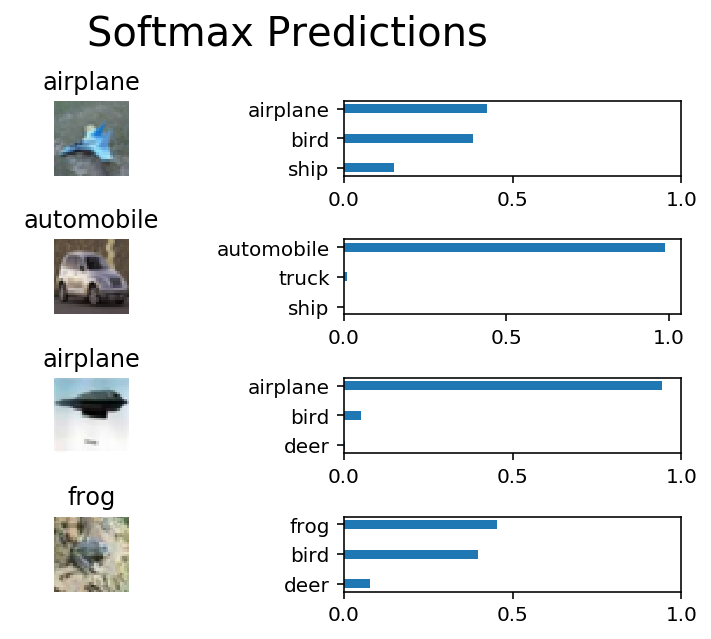
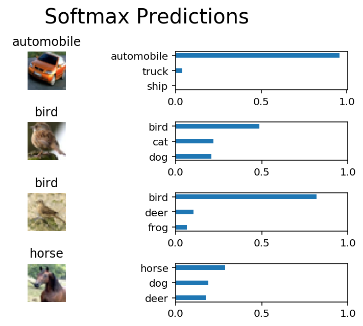
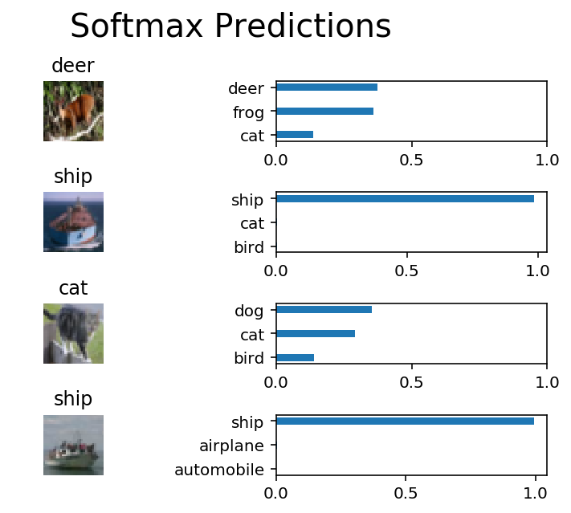

#  Image Classification using Convolutional Neural Notwork 

In this project, images from the [CIFAR-10 dataset](https://www.cs.toronto.edu/~kriz/cifar.html), which consists of airplanes, dogs, cats, and other objects, are classified. First the images are processed. Then a convolutional neural network(CNN) is built and trained on all the samples. At the end, the neural network's predictions on the sample images are evaluated.

###  A sample prediction from the trained network 
The accuracy of this trained model is 73%. 

 

