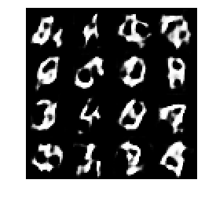
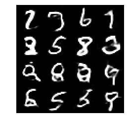
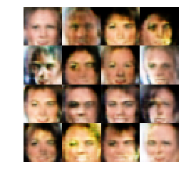
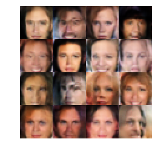
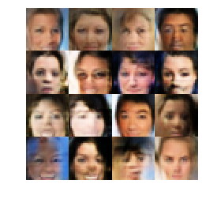

# Face Generation
In this project, a [Deep Convolutional Generative Adversarial Network (DCGAN)](https://arxiv.org/abs/1511.06434) is used to generate realistic human faces. The performance of the network is first checked and optimized on 60000 images of MNIST data set. Then the network is trained on more than 200000 CelebA images. 
### Sample MNIST images
On the left: Real MNIST images  
On the right: Computer generated images after 2 epochs training

  
  

### Sample CelebA images
On the left: Real CelebA images  
On the right: Computer generated images after 1 epoch training

  
  

### Progression of generated image quality with training
The images below show how the quality of computer generated images improves as training advances. The training progresses by row from left to right.
#### _*Generated MNIST images*_

  
  
  
  
  
  
  
  
  
  
  
  
  
  
  
  
  
   

#### _*Generated CelebA images*_

  
  
  
  
  
  
  
  
  
  
  
  
  
  
  
  
  
   
  
   
  
  
  
  
  
  
  
  
  
  
  

