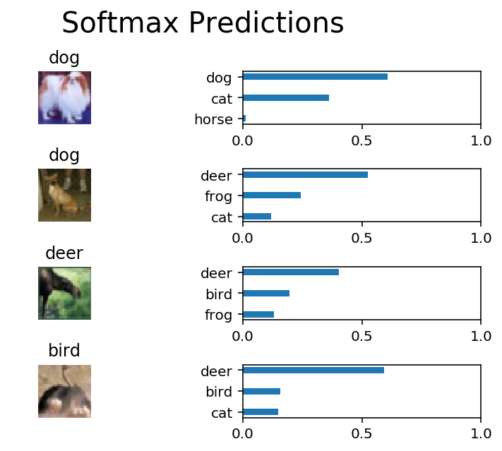

# Image Classification
In this project, you'll classify images from the [CIFAR-10 dataset](https://www.cs.toronto.edu/~kriz/cifar.html).  The dataset consists of airplanes, dogs, cats, and other objects. You'll preprocess the images, then train a convolutional neural network on all the samples. The images need to be normalized and the labels need to be one-hot encoded.  You'll get to apply what you learned and build a convolutional, max pooling, dropout, and fully connected layers.  At the end, you'll get to see your neural network's predictions on the sample images.
## Get the Data
Run the following cell to download the [CIFAR-10 dataset for python](https://www.cs.toronto.edu/~kriz/cifar-10-python.tar.gz).


```python
"""
DON'T MODIFY ANYTHING IN THIS CELL THAT IS BELOW THIS LINE
"""
from urllib.request import urlretrieve
from os.path import isfile, isdir
from tqdm import tqdm
import problem_unittests as tests
import tarfile

cifar10_dataset_folder_path = 'cifar-10-batches-py'

# Use Floyd's cifar-10 dataset if present
floyd_cifar10_location = '/cifar/cifar-10-python.tar.gz'
if isfile(floyd_cifar10_location):
    tar_gz_path = floyd_cifar10_location
else:
    tar_gz_path = 'cifar-10-python.tar.gz'

class DLProgress(tqdm):
    last_block = 0

    def hook(self, block_num=1, block_size=1, total_size=None):
        self.total = total_size
        self.update((block_num - self.last_block) * block_size)
        self.last_block = block_num

if not isfile(tar_gz_path):
    with DLProgress(unit='B', unit_scale=True, miniters=1, desc='CIFAR-10 Dataset') as pbar:
        urlretrieve(
            'https://www.cs.toronto.edu/~kriz/cifar-10-python.tar.gz',
            tar_gz_path,
            pbar.hook)

if not isdir(cifar10_dataset_folder_path):
    with tarfile.open(tar_gz_path) as tar:
        tar.extractall()
        tar.close()


tests.test_folder_path(cifar10_dataset_folder_path)
```

## Explore the Data
The dataset is broken into batches to prevent your machine from running out of memory.  The CIFAR-10 dataset consists of 5 batches, named `data_batch_1`, `data_batch_2`, etc.. Each batch contains the labels and images that are one of the following:
* airplane
* automobile
* bird
* cat
* deer
* dog
* frog
* horse
* ship
* truck

Understanding a dataset is part of making predictions on the data.  Play around with the code cell below by changing the `batch_id` and `sample_id`. The `batch_id` is the id for a batch (1-5). The `sample_id` is the id for a image and label pair in the batch.

Ask yourself "What are all possible labels?", "What is the range of values for the image data?", "Are the labels in order or random?".  Answers to questions like these will help you preprocess the data and end up with better predictions.


```python
%matplotlib inline
%config InlineBackend.figure_format = 'retina'

import helper
import numpy as np

# Explore the dataset
batch_id = 1
sample_id = 5
helper.display_stats(cifar10_dataset_folder_path, batch_id, sample_id)
```

## Implement Preprocess Functions
### Normalize
In the cell below, implement the `normalize` function to take in image data, `x`, and return it as a normalized Numpy array. The values should be in the range of 0 to 1, inclusive.  The return object should be the same shape as `x`.


```python
def normalize(x):
    """
    Normalize a list of sample image data in the range of 0 to 1
    : x: List of image data.  The image shape is (32, 32, 3)
    : return: Numpy array of normalize data
    """
    return x / 256


"""
DON'T MODIFY ANYTHING IN THIS CELL THAT IS BELOW THIS LINE
"""
tests.test_normalize(normalize)
```

### One-hot encode
Just like the previous code cell, you'll be implementing a function for preprocessing.  This time, you'll implement the `one_hot_encode` function. The input, `x`, are a list of labels.  Implement the function to return the list of labels as One-Hot encoded Numpy array.  The possible values for labels are 0 to 9. The one-hot encoding function should return the same encoding for each value between each call to `one_hot_encode`.  Make sure to save the map of encodings outside the function.

Hint: Don't reinvent the wheel.


```python
from sklearn.preprocessing import LabelBinarizer

def one_hot_encode(x):
    """
    One hot encode a list of sample labels. Return a one-hot encoded vector for each label.
    : x: List of sample Labels
    : return: Numpy array of one-hot encoded labels
    """
    return np.identity(10)[x]


"""
DON'T MODIFY ANYTHING IN THIS CELL THAT IS BELOW THIS LINE
"""
tests.test_one_hot_encode(one_hot_encode)
```

### Randomize Data
As you saw from exploring the data above, the order of the samples are randomized.  It doesn't hurt to randomize it again, but you don't need to for this dataset.

## Preprocess all the data and save it
Running the code cell below will preprocess all the CIFAR-10 data and save it to file. The code below also uses 10% of the training data for validation.


```python
"""
DON'T MODIFY ANYTHING IN THIS CELL
"""
# Preprocess Training, Validation, and Testing Data
helper.preprocess_and_save_data(cifar10_dataset_folder_path, normalize, one_hot_encode)
```

# Check Point
This is your first checkpoint.  If you ever decide to come back to this notebook or have to restart the notebook, you can start from here.  The preprocessed data has been saved to disk.


```python
"""
DON'T MODIFY ANYTHING IN THIS CELL
"""
import pickle
import problem_unittests as tests
import helper

# Load the Preprocessed Validation data
valid_features, valid_labels = pickle.load(open('preprocess_validation.p', mode='rb'))
```

## Build the network
For the neural network, you'll build each layer into a function.  Most of the code you've seen has been outside of functions. To test your code more thoroughly, we require that you put each layer in a function.  This allows us to give you better feedback and test for simple mistakes using our unittests before you submit your project.

>**Note:** If you're finding it hard to dedicate enough time for this course each week, we've provided a small shortcut to this part of the project. In the next couple of problems, you'll have the option to use classes from the [TensorFlow Layers](https://www.tensorflow.org/api_docs/python/tf/layers) or [TensorFlow Layers (contrib)](https://www.tensorflow.org/api_guides/python/contrib.layers) packages to build each layer, except the layers you build in the "Convolutional and Max Pooling Layer" section.  TF Layers is similar to Keras's and TFLearn's abstraction to layers, so it's easy to pickup.

>However, if you would like to get the most out of this course, try to solve all the problems _without_ using anything from the TF Layers packages. You **can** still use classes from other packages that happen to have the same name as ones you find in TF Layers! For example, instead of using the TF Layers version of the `conv2d` class, [tf.layers.conv2d](https://www.tensorflow.org/api_docs/python/tf/layers/conv2d), you would want to use the TF Neural Network version of `conv2d`, [tf.nn.conv2d](https://www.tensorflow.org/api_docs/python/tf/nn/conv2d). 

Let's begin!

### Input
The neural network needs to read the image data, one-hot encoded labels, and dropout keep probability. Implement the following functions
* Implement `neural_net_image_input`
 * Return a [TF Placeholder](https://www.tensorflow.org/api_docs/python/tf/placeholder)
 * Set the shape using `image_shape` with batch size set to `None`.
 * Name the TensorFlow placeholder "x" using the TensorFlow `name` parameter in the [TF Placeholder](https://www.tensorflow.org/api_docs/python/tf/placeholder).
* Implement `neural_net_label_input`
 * Return a [TF Placeholder](https://www.tensorflow.org/api_docs/python/tf/placeholder)
 * Set the shape using `n_classes` with batch size set to `None`.
 * Name the TensorFlow placeholder "y" using the TensorFlow `name` parameter in the [TF Placeholder](https://www.tensorflow.org/api_docs/python/tf/placeholder).
* Implement `neural_net_keep_prob_input`
 * Return a [TF Placeholder](https://www.tensorflow.org/api_docs/python/tf/placeholder) for dropout keep probability.
 * Name the TensorFlow placeholder "keep_prob" using the TensorFlow `name` parameter in the [TF Placeholder](https://www.tensorflow.org/api_docs/python/tf/placeholder).

These names will be used at the end of the project to load your saved model.

Note: `None` for shapes in TensorFlow allow for a dynamic size.


```python
import tensorflow as tf
from numpy import sqrt
from numpy import prod as np_prod
```


```python
def neural_net_image_input(image_shape):
    """
    Return a Tensor for a batch of image input
    : image_shape: Shape of the images
    : return: Tensor for image input.
    """
    return tf.placeholder(tf.float32, shape=(None,*image_shape), name="x")


def neural_net_label_input(n_classes):
    """
    Return a Tensor for a batch of label input
    : n_classes: Number of classes
    : return: Tensor for label input.
    """
    return tf.placeholder(tf.float32, shape=(None,n_classes), name="y")


def neural_net_keep_prob_input():
    """
    Return a Tensor for keep probability
    : return: Tensor for keep probability.
    """
    return tf.placeholder(tf.float32, name="keep_prob")


"""
DON'T MODIFY ANYTHING IN THIS CELL THAT IS BELOW THIS LINE
"""
tf.reset_default_graph()
tests.test_nn_image_inputs(neural_net_image_input)
tests.test_nn_label_inputs(neural_net_label_input)
tests.test_nn_keep_prob_inputs(neural_net_keep_prob_input)
```

    Image Input Tests Passed.
    Label Input Tests Passed.
    Keep Prob Tests Passed.
    

### Convolution and Max Pooling Layer
Convolution layers have a lot of success with images. For this code cell, you should implement the function `conv2d_maxpool` to apply convolution then max pooling:
* Create the weight and bias using `conv_ksize`, `conv_num_outputs` and the shape of `x_tensor`.
* Apply a convolution to `x_tensor` using weight and `conv_strides`.
 * We recommend you use same padding, but you're welcome to use any padding.
* Add bias
* Add a nonlinear activation to the convolution.
* Apply Max Pooling using `pool_ksize` and `pool_strides`.
 * We recommend you use same padding, but you're welcome to use any padding.

**Note:** You **can't** use [TensorFlow Layers](https://www.tensorflow.org/api_docs/python/tf/layers) or [TensorFlow Layers (contrib)](https://www.tensorflow.org/api_guides/python/contrib.layers) for **this** layer, but you can still use TensorFlow's [Neural Network](https://www.tensorflow.org/api_docs/python/tf/nn) package. You may still use the shortcut option for all the **other** layers.


```python
def conv2d_maxpool(x_tensor, conv_num_outputs, conv_ksize, conv_strides, pool_ksize, pool_strides):
    """
    Apply convolution then max pooling to x_tensor
    :param x_tensor: TensorFlow Tensor
    :param conv_num_outputs: Number of outputs for the convolutional layer
    :param conv_ksize: kernal size 2-D Tuple for the convolutional layer
    :param conv_strides: Stride 2-D Tuple for convolution
    :param pool_ksize: kernal size 2-D Tuple for pool
    :param pool_strides: Stride 2-D Tuple for pool
    : return: A tensor that represents convolution and max pooling of x_tensor
    """
    x_tensor_depth = x_tensor.shape[-1].value   # the depth of input tensor needed for weights or filter tensor
    conv_filter_shape = (*conv_ksize, x_tensor_depth, conv_num_outputs)  ## filter or weight tensor shape
    conv_ksize_num = np_prod(conv_ksize)
    std_half_size1 = 1/2/sqrt(conv_ksize_num*x_tensor_depth)
    conv_filter = tf.Variable(tf.truncated_normal(shape=conv_filter_shape,stddev=std_half_size1))
    bias = tf.Variable(tf.zeros(conv_num_outputs))
    
    ## apply the conv2d method from tensorflow
    conv_layer = tf.nn.conv2d(x_tensor, conv_filter, strides=(1,*conv_strides,1), padding='SAME')
    ## add bias to conv layer
    conv_layer = tf.nn.bias_add(conv_layer, bias)
    ## apply activation function relu
    conv_layer = tf.nn.relu(conv_layer)
    
    ## apply max_pooling from tensorflow
    conv_layer = tf.nn.max_pool(conv_layer,ksize=(1, *pool_ksize, 1),strides=(1,*pool_strides,1),padding='SAME')
    
    return conv_layer 


"""
DON'T MODIFY ANYTHING IN THIS CELL THAT IS BELOW THIS LINE
"""
tests.test_con_pool(conv2d_maxpool)
```

    Tests Passed
    

### Flatten Layer
Implement the `flatten` function to change the dimension of `x_tensor` from a 4-D tensor to a 2-D tensor.  The output should be the shape (*Batch Size*, *Flattened Image Size*). Shortcut option: you can use classes from the [TensorFlow Layers](https://www.tensorflow.org/api_docs/python/tf/layers) or [TensorFlow Layers (contrib)](https://www.tensorflow.org/api_guides/python/contrib.layers) packages for this layer. For more of a challenge, only use other TensorFlow packages.


```python
def flatten(x_tensor):
    """
    Flatten x_tensor to (Batch Size, Flattened Image Size)
    : x_tensor: A tensor of size (Batch Size, ...), where ... are the image dimensions.
    : return: A tensor of size (Batch Size, Flattened Image Size).
    """
    flattened_size = x_tensor.shape[1:].num_elements()
    return tf.reshape(x_tensor, [-1,flattened_size])


"""
DON'T MODIFY ANYTHING IN THIS CELL THAT IS BELOW THIS LINE
"""
tests.test_flatten(flatten)
```

    Tests Passed
    

### Fully-Connected Layer
Implement the `fully_conn` function to apply a fully connected layer to `x_tensor` with the shape (*Batch Size*, *num_outputs*). Shortcut option: you can use classes from the [TensorFlow Layers](https://www.tensorflow.org/api_docs/python/tf/layers) or [TensorFlow Layers (contrib)](https://www.tensorflow.org/api_guides/python/contrib.layers) packages for this layer. For more of a challenge, only use other TensorFlow packages.


```python
def fully_conn(x_tensor, num_outputs):
    """
    Apply a fully connected layer to x_tensor using weight and bias
    : x_tensor: A 2-D tensor where the first dimension is batch size.
    : num_outputs: The number of output that the new tensor should be.
    : return: A 2-D tensor where the second dimension is num_outputs.
    """
    input_dim = x_tensor.shape[-1].value  ## the depth of input tensor needed for weights or filter
    std_half_size2 = 1/2/sqrt(input_dim)
    weights = tf.Variable(tf.truncated_normal(shape=[input_dim, num_outputs], stddev=std_half_size2))
    bias = tf.Variable(tf.zeros(num_outputs))
    
    fully_conn_layer = tf.matmul(x_tensor, weights)
    fully_conn_layer = tf.add(fully_conn_layer, bias)
    fully_conn_layer = tf.nn.relu(fully_conn_layer)

    return fully_conn_layer


"""
DON'T MODIFY ANYTHING IN THIS CELL THAT IS BELOW THIS LINE
"""
tests.test_fully_conn(fully_conn)
```

    Tests Passed
    

### Output Layer
Implement the `output` function to apply a fully connected layer to `x_tensor` with the shape (*Batch Size*, *num_outputs*). Shortcut option: you can use classes from the [TensorFlow Layers](https://www.tensorflow.org/api_docs/python/tf/layers) or [TensorFlow Layers (contrib)](https://www.tensorflow.org/api_guides/python/contrib.layers) packages for this layer. For more of a challenge, only use other TensorFlow packages.

**Note:** Activation, softmax, or cross entropy should **not** be applied to this.


```python
def output(x_tensor, num_outputs):
    """
    Apply a output layer to x_tensor using weight and bias
    : x_tensor: A 2-D tensor where the first dimension is batch size.
    : num_outputs: The number of output that the new tensor should be.
    : return: A 2-D tensor where the second dimension is num_outputs.
    """
    input_dim = x_tensor.shape[-1].value  ## the depth of input tensor needed for weights or filter
    std_half_size3 = 1/2/sqrt(input_dim)
    weights = tf.Variable(tf.truncated_normal(shape=[input_dim, num_outputs], stddev=std_half_size3))
    bias = tf.Variable(tf.zeros(num_outputs))
    
    output_layer = tf.matmul(x_tensor, weights)
    output_layer = tf.add(output_layer, bias)

    return output_layer


"""
DON'T MODIFY ANYTHING IN THIS CELL THAT IS BELOW THIS LINE
"""
tests.test_output(output)
```

    Tests Passed
    

### Create Convolutional Model
Implement the function `conv_net` to create a convolutional neural network model. The function takes in a batch of images, `x`, and outputs logits.  Use the layers you created above to create this model:

* Apply 1, 2, or 3 Convolution and Max Pool layers
* Apply a Flatten Layer
* Apply 1, 2, or 3 Fully Connected Layers
* Apply an Output Layer
* Return the output
* Apply [TensorFlow's Dropout](https://www.tensorflow.org/api_docs/python/tf/nn/dropout) to one or more layers in the model using `keep_prob`. 


```python
def conv_net(x, keep_prob):
    """
    Create a convolutional neural network model
    : x: Placeholder tensor that holds image data.
    : keep_prob: Placeholder tensor that hold dropout keep probability.
    : return: Tensor that represents logits
    """
    conv_ksize, conv_strides = [5,5], [1,1]
    pool_ksize, pool_strides = [2,2], [2,2]
    conv_num_outputs_1 = 16
    conv_layer_1 = conv2d_maxpool(x, conv_num_outputs_1, conv_ksize, conv_strides, pool_ksize, pool_strides)
    conv_layer_1 = tf.nn.dropout(conv_layer_1, keep_prob)
    conv_num_outputs_2 = 32
    conv_layer_2 = conv2d_maxpool(conv_layer_1, conv_num_outputs_2, conv_ksize, conv_strides, pool_ksize, pool_strides)
    conv_layer_2 = tf.nn.dropout(conv_layer_2, keep_prob)
    conv_num_outputs_3 = 64
    conv_layer_3 = conv2d_maxpool(conv_layer_2, conv_num_outputs_3, conv_ksize, conv_strides, pool_ksize, pool_strides)
    conv_layer_3 = tf.nn.dropout(conv_layer_3, keep_prob)

    last_layer_flattened = flatten(conv_layer_3)
    
    num_outputs_1 = 64
    fully_conn_layer_1 = fully_conn(last_layer_flattened, num_outputs_1)
    num_outputs_2 = 32
    fully_conn_layer_2 = fully_conn(fully_conn_layer_1, num_outputs_1)
    
    num_classes = 10
    output_layer = output(fully_conn_layer_2, num_classes)
    
    return output_layer


"""
DON'T MODIFY ANYTHING IN THIS CELL THAT IS BELOW THIS LINE
"""

##############################
## Build the Neural Network ##
##############################

# Remove previous weights, bias, inputs, etc..
tf.reset_default_graph()

# Inputs
x = neural_net_image_input((32, 32, 3))
y = neural_net_label_input(10)
keep_prob = neural_net_keep_prob_input()

# Model
logits = conv_net(x, keep_prob)

# Name logits Tensor, so that is can be loaded from disk after training
logits = tf.identity(logits, name='logits')

# Loss and Optimizer
cost = tf.reduce_mean(tf.nn.softmax_cross_entropy_with_logits(logits=logits, labels=y))
optimizer = tf.train.AdamOptimizer().minimize(cost)

# Accuracy
correct_pred = tf.equal(tf.argmax(logits, 1), tf.argmax(y, 1))
accuracy = tf.reduce_mean(tf.cast(correct_pred, tf.float32), name='accuracy')

tests.test_conv_net(conv_net)
```

    Neural Network Built!
    

## Train the Neural Network
### Single Optimization
Implement the function `train_neural_network` to do a single optimization.  The optimization should use `optimizer` to optimize in `session` with a `feed_dict` of the following:
* `x` for image input
* `y` for labels
* `keep_prob` for keep probability for dropout

This function will be called for each batch, so `tf.global_variables_initializer()` has already been called.

Note: Nothing needs to be returned. This function is only optimizing the neural network.


```python
def train_neural_network(session, optimizer, keep_probability, feature_batch, label_batch):
    """
    Optimize the session on a batch of images and labels
    : session: Current TensorFlow session
    : optimizer: TensorFlow optimizer function
    : keep_probability: keep probability
    : feature_batch: Batch of Numpy image data
    : label_batch: Batch of Numpy label data
    """
    session.run(optimizer, feed_dict={x: feature_batch, y: label_batch, keep_prob: keep_probability})


"""
DON'T MODIFY ANYTHING IN THIS CELL THAT IS BELOW THIS LINE
"""
tests.test_train_nn(train_neural_network)
```

    Tests Passed
    

### Show Stats
Implement the function `print_stats` to print loss and validation accuracy.  Use the global variables `valid_features` and `valid_labels` to calculate validation accuracy.  Use a keep probability of `1.0` to calculate the loss and validation accuracy.


```python
def print_stats(session, feature_batch, label_batch, cost, accuracy):
    """
    Print information about loss and validation accuracy
    : session: Current TensorFlow session
    : feature_batch: Batch of Numpy image data
    : label_batch: Batch of Numpy label data
    : cost: TensorFlow cost function
    : accuracy: TensorFlow accuracy function
    """
    loss = session.run(cost, feed_dict={x: feature_batch, y: label_batch, keep_prob: 1.0})
    accuracy = session.run(accuracy, feed_dict={x: feature_batch, y: label_batch, keep_prob: 1.0})
    print("Loss: {0:.3f}\t Accuracy: {1:.1f}%".format(loss, 100*accuracy))
    # accuracy = session.run(accuracy, feed_dict={x: feature_batch, y: label_batch, keep_prob: 1.0})
    # print("Loss: {0}\t Accuracy: {1}%".format(loss, accuracy))
```

### Hyperparameters
Tune the following parameters:
* Set `epochs` to the number of iterations until the network stops learning or start overfitting
* Set `batch_size` to the highest number that your machine has memory for.  Most people set them to common sizes of memory:
 * 64
 * 128
 * 256
 * ...
* Set `keep_probability` to the probability of keeping a node using dropout


```python
# Hyperparameters
epochs = 50
batch_size = 512
keep_probability = 0.6
```

### Train on a Single CIFAR-10 Batch
Instead of training the neural network on all the CIFAR-10 batches of data, let's use a single batch. This should save time while you iterate on the model to get a better accuracy.  Once the final validation accuracy is 50% or greater, run the model on all the data in the next section.


```python
"""
DON'T MODIFY ANYTHING IN THIS CELL
"""
print('Checking the Training on a Single Batch...')
with tf.Session() as sess:
    # Initializing the variables
    sess.run(tf.global_variables_initializer())
    
    # Training cycle
    for epoch in range(epochs):
        batch_i = 1
        for batch_features, batch_labels in helper.load_preprocess_training_batch(batch_i, batch_size):
            train_neural_network(sess, optimizer, keep_probability, batch_features, batch_labels)
        print('Epoch {:>2}, CIFAR-10 Batch {}:  '.format(epoch + 1, batch_i), end='')
        print_stats(sess, batch_features, batch_labels, cost, accuracy)
```

    Checking the Training on a Single Batch...
    Epoch  1, CIFAR-10 Batch 1:  Loss: 2.208	 Accuracy: 15.2%
    Epoch  2, CIFAR-10 Batch 1:  Loss: 2.177	 Accuracy: 19.6%
    Epoch  3, CIFAR-10 Batch 1:  Loss: 2.074	 Accuracy: 26.0%
    Epoch  4, CIFAR-10 Batch 1:  Loss: 2.005	 Accuracy: 29.4%
    Epoch  5, CIFAR-10 Batch 1:  Loss: 1.893	 Accuracy: 32.8%
    Epoch  6, CIFAR-10 Batch 1:  Loss: 1.850	 Accuracy: 32.4%
    Epoch  7, CIFAR-10 Batch 1:  Loss: 1.828	 Accuracy: 33.8%
    Epoch  8, CIFAR-10 Batch 1:  Loss: 1.795	 Accuracy: 36.1%
    Epoch  9, CIFAR-10 Batch 1:  Loss: 1.785	 Accuracy: 36.5%
    Epoch 10, CIFAR-10 Batch 1:  Loss: 1.745	 Accuracy: 39.5%
    Epoch 11, CIFAR-10 Batch 1:  Loss: 1.738	 Accuracy: 42.9%
    Epoch 12, CIFAR-10 Batch 1:  Loss: 1.711	 Accuracy: 44.9%
    Epoch 13, CIFAR-10 Batch 1:  Loss: 1.695	 Accuracy: 44.3%
    Epoch 14, CIFAR-10 Batch 1:  Loss: 1.678	 Accuracy: 44.3%
    Epoch 15, CIFAR-10 Batch 1:  Loss: 1.668	 Accuracy: 44.9%
    Epoch 16, CIFAR-10 Batch 1:  Loss: 1.645	 Accuracy: 46.3%
    Epoch 17, CIFAR-10 Batch 1:  Loss: 1.639	 Accuracy: 43.9%
    Epoch 18, CIFAR-10 Batch 1:  Loss: 1.622	 Accuracy: 44.9%
    Epoch 19, CIFAR-10 Batch 1:  Loss: 1.597	 Accuracy: 45.6%
    Epoch 20, CIFAR-10 Batch 1:  Loss: 1.583	 Accuracy: 46.6%
    Epoch 21, CIFAR-10 Batch 1:  Loss: 1.575	 Accuracy: 47.3%
    Epoch 22, CIFAR-10 Batch 1:  Loss: 1.550	 Accuracy: 46.3%
    Epoch 23, CIFAR-10 Batch 1:  Loss: 1.544	 Accuracy: 47.6%
    Epoch 24, CIFAR-10 Batch 1:  Loss: 1.553	 Accuracy: 49.0%
    Epoch 25, CIFAR-10 Batch 1:  Loss: 1.528	 Accuracy: 48.3%
    Epoch 26, CIFAR-10 Batch 1:  Loss: 1.503	 Accuracy: 48.6%
    Epoch 27, CIFAR-10 Batch 1:  Loss: 1.487	 Accuracy: 48.3%
    Epoch 28, CIFAR-10 Batch 1:  Loss: 1.477	 Accuracy: 48.3%
    Epoch 29, CIFAR-10 Batch 1:  Loss: 1.460	 Accuracy: 49.0%
    Epoch 30, CIFAR-10 Batch 1:  Loss: 1.448	 Accuracy: 48.3%
    Epoch 31, CIFAR-10 Batch 1:  Loss: 1.433	 Accuracy: 47.6%
    Epoch 32, CIFAR-10 Batch 1:  Loss: 1.411	 Accuracy: 48.6%
    Epoch 33, CIFAR-10 Batch 1:  Loss: 1.392	 Accuracy: 50.0%
    Epoch 34, CIFAR-10 Batch 1:  Loss: 1.384	 Accuracy: 52.0%
    Epoch 35, CIFAR-10 Batch 1:  Loss: 1.349	 Accuracy: 51.7%
    Epoch 36, CIFAR-10 Batch 1:  Loss: 1.352	 Accuracy: 51.0%
    Epoch 37, CIFAR-10 Batch 1:  Loss: 1.328	 Accuracy: 50.3%
    Epoch 38, CIFAR-10 Batch 1:  Loss: 1.309	 Accuracy: 51.4%
    Epoch 39, CIFAR-10 Batch 1:  Loss: 1.286	 Accuracy: 52.7%
    Epoch 40, CIFAR-10 Batch 1:  Loss: 1.276	 Accuracy: 52.4%
    Epoch 41, CIFAR-10 Batch 1:  Loss: 1.270	 Accuracy: 53.7%
    Epoch 42, CIFAR-10 Batch 1:  Loss: 1.264	 Accuracy: 53.4%
    Epoch 43, CIFAR-10 Batch 1:  Loss: 1.240	 Accuracy: 56.1%
    Epoch 44, CIFAR-10 Batch 1:  Loss: 1.219	 Accuracy: 54.4%
    Epoch 45, CIFAR-10 Batch 1:  Loss: 1.200	 Accuracy: 56.4%
    Epoch 46, CIFAR-10 Batch 1:  Loss: 1.198	 Accuracy: 56.8%
    Epoch 47, CIFAR-10 Batch 1:  Loss: 1.185	 Accuracy: 58.4%
    Epoch 48, CIFAR-10 Batch 1:  Loss: 1.179	 Accuracy: 59.5%
    Epoch 49, CIFAR-10 Batch 1:  Loss: 1.149	 Accuracy: 59.8%
    Epoch 50, CIFAR-10 Batch 1:  Loss: 1.145	 Accuracy: 61.1%
    

### Fully Train the Model
Now that you got a good accuracy with a single CIFAR-10 batch, try it with all five batches.


```python
"""
DON'T MODIFY ANYTHING IN THIS CELL
"""
save_model_path = './image_classification'

print('Training...')
with tf.Session() as sess:
    # Initializing the variables
    sess.run(tf.global_variables_initializer())
    
    # Training cycle
    for epoch in range(epochs):
        # Loop over all batches
        n_batches = 5
        for batch_i in range(1, n_batches + 1):
            for batch_features, batch_labels in helper.load_preprocess_training_batch(batch_i, batch_size):
                train_neural_network(sess, optimizer, keep_probability, batch_features, batch_labels)
            print('Epoch {:>2}, CIFAR-10 Batch {}:  '.format(epoch + 1, batch_i), end='')
            print_stats(sess, batch_features, batch_labels, cost, accuracy)
            
    # Save Model
    saver = tf.train.Saver()
    save_path = saver.save(sess, save_model_path)
```

    Training...
    Epoch  1, CIFAR-10 Batch 1:  Loss: 2.252	 Accuracy: 10.5%
    Epoch  1, CIFAR-10 Batch 2:  Loss: 2.169	 Accuracy: 19.9%
    Epoch  1, CIFAR-10 Batch 3:  Loss: 2.062	 Accuracy: 23.0%
    Epoch  1, CIFAR-10 Batch 4:  Loss: 1.926	 Accuracy: 29.7%
    Epoch  1, CIFAR-10 Batch 5:  Loss: 1.909	 Accuracy: 33.4%
    Epoch  2, CIFAR-10 Batch 1:  Loss: 1.886	 Accuracy: 34.5%
    Epoch  2, CIFAR-10 Batch 2:  Loss: 1.778	 Accuracy: 35.1%
    Epoch  2, CIFAR-10 Batch 3:  Loss: 1.624	 Accuracy: 45.9%
    Epoch  2, CIFAR-10 Batch 4:  Loss: 1.650	 Accuracy: 38.2%
    Epoch  2, CIFAR-10 Batch 5:  Loss: 1.730	 Accuracy: 36.1%
    Epoch  3, CIFAR-10 Batch 1:  Loss: 1.701	 Accuracy: 41.2%
    Epoch  3, CIFAR-10 Batch 2:  Loss: 1.652	 Accuracy: 40.2%
    Epoch  3, CIFAR-10 Batch 3:  Loss: 1.475	 Accuracy: 49.7%
    Epoch  3, CIFAR-10 Batch 4:  Loss: 1.548	 Accuracy: 40.9%
    Epoch  3, CIFAR-10 Batch 5:  Loss: 1.592	 Accuracy: 45.3%
    Epoch  4, CIFAR-10 Batch 1:  Loss: 1.584	 Accuracy: 45.9%
    Epoch  4, CIFAR-10 Batch 2:  Loss: 1.560	 Accuracy: 43.6%
    Epoch  4, CIFAR-10 Batch 3:  Loss: 1.408	 Accuracy: 50.3%
    Epoch  4, CIFAR-10 Batch 4:  Loss: 1.455	 Accuracy: 44.9%
    Epoch  4, CIFAR-10 Batch 5:  Loss: 1.485	 Accuracy: 47.0%
    Epoch  5, CIFAR-10 Batch 1:  Loss: 1.519	 Accuracy: 48.0%
    Epoch  5, CIFAR-10 Batch 2:  Loss: 1.475	 Accuracy: 47.3%
    Epoch  5, CIFAR-10 Batch 3:  Loss: 1.308	 Accuracy: 54.7%
    Epoch  5, CIFAR-10 Batch 4:  Loss: 1.374	 Accuracy: 46.6%
    Epoch  5, CIFAR-10 Batch 5:  Loss: 1.398	 Accuracy: 52.4%
    Epoch  6, CIFAR-10 Batch 1:  Loss: 1.467	 Accuracy: 49.0%
    Epoch  6, CIFAR-10 Batch 2:  Loss: 1.394	 Accuracy: 50.7%
    Epoch  6, CIFAR-10 Batch 3:  Loss: 1.266	 Accuracy: 55.1%
    Epoch  6, CIFAR-10 Batch 4:  Loss: 1.312	 Accuracy: 51.7%
    Epoch  6, CIFAR-10 Batch 5:  Loss: 1.345	 Accuracy: 53.0%
    Epoch  7, CIFAR-10 Batch 1:  Loss: 1.422	 Accuracy: 50.3%
    Epoch  7, CIFAR-10 Batch 2:  Loss: 1.361	 Accuracy: 52.4%
    Epoch  7, CIFAR-10 Batch 3:  Loss: 1.228	 Accuracy: 57.1%
    Epoch  7, CIFAR-10 Batch 4:  Loss: 1.262	 Accuracy: 52.0%
    Epoch  7, CIFAR-10 Batch 5:  Loss: 1.287	 Accuracy: 58.1%
    Epoch  8, CIFAR-10 Batch 1:  Loss: 1.378	 Accuracy: 51.4%
    Epoch  8, CIFAR-10 Batch 2:  Loss: 1.317	 Accuracy: 55.7%
    Epoch  8, CIFAR-10 Batch 3:  Loss: 1.202	 Accuracy: 57.1%
    Epoch  8, CIFAR-10 Batch 4:  Loss: 1.210	 Accuracy: 56.4%
    Epoch  8, CIFAR-10 Batch 5:  Loss: 1.240	 Accuracy: 55.7%
    Epoch  9, CIFAR-10 Batch 1:  Loss: 1.342	 Accuracy: 56.1%
    Epoch  9, CIFAR-10 Batch 2:  Loss: 1.271	 Accuracy: 57.8%
    Epoch  9, CIFAR-10 Batch 3:  Loss: 1.163	 Accuracy: 58.1%
    Epoch  9, CIFAR-10 Batch 4:  Loss: 1.176	 Accuracy: 56.8%
    Epoch  9, CIFAR-10 Batch 5:  Loss: 1.196	 Accuracy: 56.4%
    Epoch 10, CIFAR-10 Batch 1:  Loss: 1.289	 Accuracy: 56.4%
    Epoch 10, CIFAR-10 Batch 2:  Loss: 1.240	 Accuracy: 60.1%
    Epoch 10, CIFAR-10 Batch 3:  Loss: 1.119	 Accuracy: 60.8%
    Epoch 10, CIFAR-10 Batch 4:  Loss: 1.130	 Accuracy: 58.4%
    Epoch 10, CIFAR-10 Batch 5:  Loss: 1.168	 Accuracy: 58.4%
    Epoch 11, CIFAR-10 Batch 1:  Loss: 1.259	 Accuracy: 59.1%
    Epoch 11, CIFAR-10 Batch 2:  Loss: 1.235	 Accuracy: 60.5%
    Epoch 11, CIFAR-10 Batch 3:  Loss: 1.068	 Accuracy: 61.5%
    Epoch 11, CIFAR-10 Batch 4:  Loss: 1.102	 Accuracy: 62.8%
    Epoch 11, CIFAR-10 Batch 5:  Loss: 1.125	 Accuracy: 59.8%
    Epoch 12, CIFAR-10 Batch 1:  Loss: 1.219	 Accuracy: 60.5%
    Epoch 12, CIFAR-10 Batch 2:  Loss: 1.206	 Accuracy: 61.5%
    Epoch 12, CIFAR-10 Batch 3:  Loss: 1.059	 Accuracy: 61.5%
    Epoch 12, CIFAR-10 Batch 4:  Loss: 1.051	 Accuracy: 63.5%
    Epoch 12, CIFAR-10 Batch 5:  Loss: 1.097	 Accuracy: 63.2%
    Epoch 13, CIFAR-10 Batch 1:  Loss: 1.194	 Accuracy: 62.2%
    Epoch 13, CIFAR-10 Batch 2:  Loss: 1.205	 Accuracy: 59.8%
    Epoch 13, CIFAR-10 Batch 3:  Loss: 1.033	 Accuracy: 62.2%
    Epoch 13, CIFAR-10 Batch 4:  Loss: 1.027	 Accuracy: 63.5%
    Epoch 13, CIFAR-10 Batch 5:  Loss: 1.057	 Accuracy: 64.9%
    Epoch 14, CIFAR-10 Batch 1:  Loss: 1.153	 Accuracy: 60.8%
    Epoch 14, CIFAR-10 Batch 2:  Loss: 1.142	 Accuracy: 64.9%
    Epoch 14, CIFAR-10 Batch 3:  Loss: 1.026	 Accuracy: 64.2%
    Epoch 14, CIFAR-10 Batch 4:  Loss: 1.006	 Accuracy: 65.5%
    Epoch 14, CIFAR-10 Batch 5:  Loss: 1.024	 Accuracy: 64.9%
    Epoch 15, CIFAR-10 Batch 1:  Loss: 1.123	 Accuracy: 61.8%
    Epoch 15, CIFAR-10 Batch 2:  Loss: 1.099	 Accuracy: 62.8%
    Epoch 15, CIFAR-10 Batch 3:  Loss: 0.974	 Accuracy: 64.9%
    Epoch 15, CIFAR-10 Batch 4:  Loss: 0.974	 Accuracy: 66.9%
    Epoch 15, CIFAR-10 Batch 5:  Loss: 0.996	 Accuracy: 65.9%
    Epoch 16, CIFAR-10 Batch 1:  Loss: 1.111	 Accuracy: 63.5%
    Epoch 16, CIFAR-10 Batch 2:  Loss: 1.091	 Accuracy: 63.5%
    Epoch 16, CIFAR-10 Batch 3:  Loss: 0.944	 Accuracy: 65.9%
    Epoch 16, CIFAR-10 Batch 4:  Loss: 0.953	 Accuracy: 64.5%
    Epoch 16, CIFAR-10 Batch 5:  Loss: 0.998	 Accuracy: 65.9%
    Epoch 17, CIFAR-10 Batch 1:  Loss: 1.096	 Accuracy: 63.5%
    Epoch 17, CIFAR-10 Batch 2:  Loss: 1.056	 Accuracy: 63.9%
    Epoch 17, CIFAR-10 Batch 3:  Loss: 0.914	 Accuracy: 70.3%
    Epoch 17, CIFAR-10 Batch 4:  Loss: 0.942	 Accuracy: 68.2%
    Epoch 17, CIFAR-10 Batch 5:  Loss: 0.960	 Accuracy: 66.9%
    Epoch 18, CIFAR-10 Batch 1:  Loss: 1.054	 Accuracy: 63.5%
    Epoch 18, CIFAR-10 Batch 2:  Loss: 1.016	 Accuracy: 64.9%
    Epoch 18, CIFAR-10 Batch 3:  Loss: 0.911	 Accuracy: 69.6%
    Epoch 18, CIFAR-10 Batch 4:  Loss: 0.909	 Accuracy: 68.2%
    Epoch 18, CIFAR-10 Batch 5:  Loss: 0.953	 Accuracy: 66.2%
    Epoch 19, CIFAR-10 Batch 1:  Loss: 1.005	 Accuracy: 69.3%
    Epoch 19, CIFAR-10 Batch 2:  Loss: 1.037	 Accuracy: 63.2%
    Epoch 19, CIFAR-10 Batch 3:  Loss: 0.898	 Accuracy: 70.9%
    Epoch 19, CIFAR-10 Batch 4:  Loss: 0.888	 Accuracy: 68.9%
    Epoch 19, CIFAR-10 Batch 5:  Loss: 0.932	 Accuracy: 67.9%
    Epoch 20, CIFAR-10 Batch 1:  Loss: 0.983	 Accuracy: 69.3%
    Epoch 20, CIFAR-10 Batch 2:  Loss: 0.974	 Accuracy: 66.9%
    Epoch 20, CIFAR-10 Batch 3:  Loss: 0.880	 Accuracy: 71.3%
    Epoch 20, CIFAR-10 Batch 4:  Loss: 0.863	 Accuracy: 70.9%
    Epoch 20, CIFAR-10 Batch 5:  Loss: 0.903	 Accuracy: 66.2%
    Epoch 21, CIFAR-10 Batch 1:  Loss: 0.968	 Accuracy: 69.3%
    Epoch 21, CIFAR-10 Batch 2:  Loss: 0.975	 Accuracy: 65.5%
    Epoch 21, CIFAR-10 Batch 3:  Loss: 0.852	 Accuracy: 70.9%
    Epoch 21, CIFAR-10 Batch 4:  Loss: 0.836	 Accuracy: 73.3%
    Epoch 21, CIFAR-10 Batch 5:  Loss: 0.891	 Accuracy: 69.6%
    Epoch 22, CIFAR-10 Batch 1:  Loss: 0.961	 Accuracy: 68.2%
    Epoch 22, CIFAR-10 Batch 2:  Loss: 0.948	 Accuracy: 64.9%
    Epoch 22, CIFAR-10 Batch 3:  Loss: 0.821	 Accuracy: 73.6%
    Epoch 22, CIFAR-10 Batch 4:  Loss: 0.821	 Accuracy: 73.0%
    Epoch 22, CIFAR-10 Batch 5:  Loss: 0.884	 Accuracy: 69.3%
    Epoch 23, CIFAR-10 Batch 1:  Loss: 0.915	 Accuracy: 72.3%
    Epoch 23, CIFAR-10 Batch 2:  Loss: 0.907	 Accuracy: 67.6%
    Epoch 23, CIFAR-10 Batch 3:  Loss: 0.799	 Accuracy: 75.7%
    Epoch 23, CIFAR-10 Batch 4:  Loss: 0.785	 Accuracy: 74.3%
    Epoch 23, CIFAR-10 Batch 5:  Loss: 0.840	 Accuracy: 70.6%
    Epoch 24, CIFAR-10 Batch 1:  Loss: 0.921	 Accuracy: 69.3%
    Epoch 24, CIFAR-10 Batch 2:  Loss: 0.890	 Accuracy: 70.6%
    Epoch 24, CIFAR-10 Batch 3:  Loss: 0.786	 Accuracy: 73.0%
    Epoch 24, CIFAR-10 Batch 4:  Loss: 0.795	 Accuracy: 74.3%
    Epoch 24, CIFAR-10 Batch 5:  Loss: 0.838	 Accuracy: 72.0%
    Epoch 25, CIFAR-10 Batch 1:  Loss: 0.888	 Accuracy: 70.9%
    Epoch 25, CIFAR-10 Batch 2:  Loss: 0.913	 Accuracy: 66.6%
    Epoch 25, CIFAR-10 Batch 3:  Loss: 0.761	 Accuracy: 75.7%
    Epoch 25, CIFAR-10 Batch 4:  Loss: 0.754	 Accuracy: 74.7%
    Epoch 25, CIFAR-10 Batch 5:  Loss: 0.809	 Accuracy: 71.6%
    Epoch 26, CIFAR-10 Batch 1:  Loss: 0.926	 Accuracy: 70.9%
    Epoch 26, CIFAR-10 Batch 2:  Loss: 0.860	 Accuracy: 70.6%
    Epoch 26, CIFAR-10 Batch 3:  Loss: 0.751	 Accuracy: 77.7%
    Epoch 26, CIFAR-10 Batch 4:  Loss: 0.746	 Accuracy: 75.3%
    Epoch 26, CIFAR-10 Batch 5:  Loss: 0.814	 Accuracy: 71.6%
    Epoch 27, CIFAR-10 Batch 1:  Loss: 0.878	 Accuracy: 71.3%
    Epoch 27, CIFAR-10 Batch 2:  Loss: 0.843	 Accuracy: 69.3%
    Epoch 27, CIFAR-10 Batch 3:  Loss: 0.760	 Accuracy: 75.0%
    Epoch 27, CIFAR-10 Batch 4:  Loss: 0.741	 Accuracy: 76.0%
    Epoch 27, CIFAR-10 Batch 5:  Loss: 0.795	 Accuracy: 72.3%
    Epoch 28, CIFAR-10 Batch 1:  Loss: 0.825	 Accuracy: 73.0%
    Epoch 28, CIFAR-10 Batch 2:  Loss: 0.879	 Accuracy: 69.3%
    Epoch 28, CIFAR-10 Batch 3:  Loss: 0.700	 Accuracy: 78.7%
    Epoch 28, CIFAR-10 Batch 4:  Loss: 0.750	 Accuracy: 75.7%
    Epoch 28, CIFAR-10 Batch 5:  Loss: 0.777	 Accuracy: 72.6%
    Epoch 29, CIFAR-10 Batch 1:  Loss: 0.827	 Accuracy: 73.6%
    Epoch 29, CIFAR-10 Batch 2:  Loss: 0.836	 Accuracy: 69.3%
    Epoch 29, CIFAR-10 Batch 3:  Loss: 0.729	 Accuracy: 77.0%
    Epoch 29, CIFAR-10 Batch 4:  Loss: 0.694	 Accuracy: 76.7%
    Epoch 29, CIFAR-10 Batch 5:  Loss: 0.758	 Accuracy: 72.3%
    Epoch 30, CIFAR-10 Batch 1:  Loss: 0.834	 Accuracy: 74.7%
    Epoch 30, CIFAR-10 Batch 2:  Loss: 0.812	 Accuracy: 70.6%
    Epoch 30, CIFAR-10 Batch 3:  Loss: 0.682	 Accuracy: 78.0%
    Epoch 30, CIFAR-10 Batch 4:  Loss: 0.685	 Accuracy: 76.7%
    Epoch 30, CIFAR-10 Batch 5:  Loss: 0.755	 Accuracy: 72.6%
    Epoch 31, CIFAR-10 Batch 1:  Loss: 0.808	 Accuracy: 73.6%
    Epoch 31, CIFAR-10 Batch 2:  Loss: 0.879	 Accuracy: 69.3%
    Epoch 31, CIFAR-10 Batch 3:  Loss: 0.688	 Accuracy: 77.4%
    Epoch 31, CIFAR-10 Batch 4:  Loss: 0.682	 Accuracy: 78.4%
    Epoch 31, CIFAR-10 Batch 5:  Loss: 0.721	 Accuracy: 75.0%
    Epoch 32, CIFAR-10 Batch 1:  Loss: 0.794	 Accuracy: 75.7%
    Epoch 32, CIFAR-10 Batch 2:  Loss: 0.755	 Accuracy: 74.3%
    Epoch 32, CIFAR-10 Batch 3:  Loss: 0.672	 Accuracy: 78.7%
    Epoch 32, CIFAR-10 Batch 4:  Loss: 0.684	 Accuracy: 78.0%
    Epoch 32, CIFAR-10 Batch 5:  Loss: 0.701	 Accuracy: 75.3%
    Epoch 33, CIFAR-10 Batch 1:  Loss: 0.807	 Accuracy: 74.0%
    Epoch 33, CIFAR-10 Batch 2:  Loss: 0.742	 Accuracy: 74.3%
    Epoch 33, CIFAR-10 Batch 3:  Loss: 0.669	 Accuracy: 78.7%
    Epoch 33, CIFAR-10 Batch 4:  Loss: 0.651	 Accuracy: 79.1%
    Epoch 33, CIFAR-10 Batch 5:  Loss: 0.714	 Accuracy: 75.0%
    Epoch 34, CIFAR-10 Batch 1:  Loss: 0.768	 Accuracy: 77.0%
    Epoch 34, CIFAR-10 Batch 2:  Loss: 0.782	 Accuracy: 72.6%
    Epoch 34, CIFAR-10 Batch 3:  Loss: 0.654	 Accuracy: 78.4%
    Epoch 34, CIFAR-10 Batch 4:  Loss: 0.646	 Accuracy: 80.4%
    Epoch 34, CIFAR-10 Batch 5:  Loss: 0.691	 Accuracy: 77.0%
    Epoch 35, CIFAR-10 Batch 1:  Loss: 0.760	 Accuracy: 76.4%
    Epoch 35, CIFAR-10 Batch 2:  Loss: 0.761	 Accuracy: 74.3%
    Epoch 35, CIFAR-10 Batch 3:  Loss: 0.671	 Accuracy: 79.7%
    Epoch 35, CIFAR-10 Batch 4:  Loss: 0.635	 Accuracy: 78.4%
    Epoch 35, CIFAR-10 Batch 5:  Loss: 0.692	 Accuracy: 78.0%
    Epoch 36, CIFAR-10 Batch 1:  Loss: 0.783	 Accuracy: 73.3%
    Epoch 36, CIFAR-10 Batch 2:  Loss: 0.814	 Accuracy: 69.9%
    Epoch 36, CIFAR-10 Batch 3:  Loss: 0.642	 Accuracy: 81.1%
    Epoch 36, CIFAR-10 Batch 4:  Loss: 0.642	 Accuracy: 80.4%
    Epoch 36, CIFAR-10 Batch 5:  Loss: 0.662	 Accuracy: 76.7%
    Epoch 37, CIFAR-10 Batch 1:  Loss: 0.724	 Accuracy: 77.0%
    Epoch 37, CIFAR-10 Batch 2:  Loss: 0.766	 Accuracy: 70.6%
    Epoch 37, CIFAR-10 Batch 3:  Loss: 0.638	 Accuracy: 80.4%
    Epoch 37, CIFAR-10 Batch 4:  Loss: 0.631	 Accuracy: 79.7%
    Epoch 37, CIFAR-10 Batch 5:  Loss: 0.673	 Accuracy: 75.7%
    Epoch 38, CIFAR-10 Batch 1:  Loss: 0.718	 Accuracy: 77.7%
    Epoch 38, CIFAR-10 Batch 2:  Loss: 0.732	 Accuracy: 74.3%
    Epoch 38, CIFAR-10 Batch 3:  Loss: 0.633	 Accuracy: 79.7%
    Epoch 38, CIFAR-10 Batch 4:  Loss: 0.632	 Accuracy: 78.4%
    Epoch 38, CIFAR-10 Batch 5:  Loss: 0.697	 Accuracy: 75.3%
    Epoch 39, CIFAR-10 Batch 1:  Loss: 0.718	 Accuracy: 76.4%
    Epoch 39, CIFAR-10 Batch 2:  Loss: 0.743	 Accuracy: 72.3%
    Epoch 39, CIFAR-10 Batch 3:  Loss: 0.603	 Accuracy: 81.8%
    Epoch 39, CIFAR-10 Batch 4:  Loss: 0.629	 Accuracy: 78.0%
    Epoch 39, CIFAR-10 Batch 5:  Loss: 0.663	 Accuracy: 76.7%
    Epoch 40, CIFAR-10 Batch 1:  Loss: 0.700	 Accuracy: 78.0%
    Epoch 40, CIFAR-10 Batch 2:  Loss: 0.707	 Accuracy: 73.6%
    Epoch 40, CIFAR-10 Batch 3:  Loss: 0.609	 Accuracy: 81.1%
    Epoch 40, CIFAR-10 Batch 4:  Loss: 0.606	 Accuracy: 81.4%
    Epoch 40, CIFAR-10 Batch 5:  Loss: 0.641	 Accuracy: 76.7%
    Epoch 41, CIFAR-10 Batch 1:  Loss: 0.703	 Accuracy: 77.4%
    Epoch 41, CIFAR-10 Batch 2:  Loss: 0.699	 Accuracy: 75.3%
    Epoch 41, CIFAR-10 Batch 3:  Loss: 0.595	 Accuracy: 82.1%
    Epoch 41, CIFAR-10 Batch 4:  Loss: 0.622	 Accuracy: 80.1%
    Epoch 41, CIFAR-10 Batch 5:  Loss: 0.638	 Accuracy: 77.7%
    Epoch 42, CIFAR-10 Batch 1:  Loss: 0.679	 Accuracy: 77.4%
    Epoch 42, CIFAR-10 Batch 2:  Loss: 0.720	 Accuracy: 75.7%
    Epoch 42, CIFAR-10 Batch 3:  Loss: 0.572	 Accuracy: 81.1%
    Epoch 42, CIFAR-10 Batch 4:  Loss: 0.596	 Accuracy: 79.4%
    Epoch 42, CIFAR-10 Batch 5:  Loss: 0.645	 Accuracy: 78.0%
    Epoch 43, CIFAR-10 Batch 1:  Loss: 0.677	 Accuracy: 78.7%
    Epoch 43, CIFAR-10 Batch 2:  Loss: 0.665	 Accuracy: 77.0%
    Epoch 43, CIFAR-10 Batch 3:  Loss: 0.623	 Accuracy: 80.7%
    Epoch 43, CIFAR-10 Batch 4:  Loss: 0.595	 Accuracy: 79.7%
    Epoch 43, CIFAR-10 Batch 5:  Loss: 0.634	 Accuracy: 78.0%
    Epoch 44, CIFAR-10 Batch 1:  Loss: 0.693	 Accuracy: 78.7%
    Epoch 44, CIFAR-10 Batch 2:  Loss: 0.627	 Accuracy: 80.4%
    Epoch 44, CIFAR-10 Batch 3:  Loss: 0.560	 Accuracy: 82.8%
    Epoch 44, CIFAR-10 Batch 4:  Loss: 0.580	 Accuracy: 80.7%
    Epoch 44, CIFAR-10 Batch 5:  Loss: 0.606	 Accuracy: 79.7%
    Epoch 45, CIFAR-10 Batch 1:  Loss: 0.665	 Accuracy: 79.1%
    Epoch 45, CIFAR-10 Batch 2:  Loss: 0.651	 Accuracy: 78.4%
    Epoch 45, CIFAR-10 Batch 3:  Loss: 0.573	 Accuracy: 80.1%
    Epoch 45, CIFAR-10 Batch 4:  Loss: 0.570	 Accuracy: 81.1%
    Epoch 45, CIFAR-10 Batch 5:  Loss: 0.649	 Accuracy: 78.4%
    Epoch 46, CIFAR-10 Batch 1:  Loss: 0.694	 Accuracy: 76.0%
    Epoch 46, CIFAR-10 Batch 2:  Loss: 0.660	 Accuracy: 78.4%
    Epoch 46, CIFAR-10 Batch 3:  Loss: 0.566	 Accuracy: 82.4%
    Epoch 46, CIFAR-10 Batch 4:  Loss: 0.554	 Accuracy: 84.8%
    Epoch 46, CIFAR-10 Batch 5:  Loss: 0.627	 Accuracy: 79.1%
    Epoch 47, CIFAR-10 Batch 1:  Loss: 0.697	 Accuracy: 76.7%
    Epoch 47, CIFAR-10 Batch 2:  Loss: 0.636	 Accuracy: 79.7%
    Epoch 47, CIFAR-10 Batch 3:  Loss: 0.532	 Accuracy: 83.1%
    Epoch 47, CIFAR-10 Batch 4:  Loss: 0.560	 Accuracy: 81.4%
    Epoch 47, CIFAR-10 Batch 5:  Loss: 0.602	 Accuracy: 79.1%
    Epoch 48, CIFAR-10 Batch 1:  Loss: 0.654	 Accuracy: 78.7%
    Epoch 48, CIFAR-10 Batch 2:  Loss: 0.623	 Accuracy: 80.7%
    Epoch 48, CIFAR-10 Batch 3:  Loss: 0.582	 Accuracy: 82.4%
    Epoch 48, CIFAR-10 Batch 4:  Loss: 0.547	 Accuracy: 83.1%
    Epoch 48, CIFAR-10 Batch 5:  Loss: 0.620	 Accuracy: 77.7%
    Epoch 49, CIFAR-10 Batch 1:  Loss: 0.662	 Accuracy: 79.1%
    Epoch 49, CIFAR-10 Batch 2:  Loss: 0.599	 Accuracy: 80.7%
    Epoch 49, CIFAR-10 Batch 3:  Loss: 0.544	 Accuracy: 82.8%
    Epoch 49, CIFAR-10 Batch 4:  Loss: 0.560	 Accuracy: 79.7%
    Epoch 49, CIFAR-10 Batch 5:  Loss: 0.581	 Accuracy: 79.1%
    Epoch 50, CIFAR-10 Batch 1:  Loss: 0.652	 Accuracy: 76.0%
    Epoch 50, CIFAR-10 Batch 2:  Loss: 0.633	 Accuracy: 79.1%
    Epoch 50, CIFAR-10 Batch 3:  Loss: 0.553	 Accuracy: 83.1%
    Epoch 50, CIFAR-10 Batch 4:  Loss: 0.542	 Accuracy: 84.8%
    Epoch 50, CIFAR-10 Batch 5:  Loss: 0.602	 Accuracy: 79.1%
    

# Checkpoint
The model has been saved to disk.
## Test Model
Test your model against the test dataset.  This will be your final accuracy. You should have an accuracy greater than 50%. If you don't, keep tweaking the model architecture and parameters.


```python
"""
DON'T MODIFY ANYTHING IN THIS CELL
"""
%matplotlib inline
%config InlineBackend.figure_format = 'retina'

import tensorflow as tf
import pickle
import helper
import random

# Set batch size if not already set
try:
    if batch_size:
        pass
except NameError:
    batch_size = 64

save_model_path = './image_classification'
n_samples = 4
top_n_predictions = 3

def test_model():
    """
    Test the saved model against the test dataset
    """

    test_features, test_labels = pickle.load(open('preprocess_test.p', mode='rb'))
    loaded_graph = tf.Graph()

    with tf.Session(graph=loaded_graph) as sess:
        # Load model
        loader = tf.train.import_meta_graph(save_model_path + '.meta')
        loader.restore(sess, save_model_path)

        # Get Tensors from loaded model
        loaded_x = loaded_graph.get_tensor_by_name('x:0')
        loaded_y = loaded_graph.get_tensor_by_name('y:0')
        loaded_keep_prob = loaded_graph.get_tensor_by_name('keep_prob:0')
        loaded_logits = loaded_graph.get_tensor_by_name('logits:0')
        loaded_acc = loaded_graph.get_tensor_by_name('accuracy:0')
        
        # Get accuracy in batches for memory limitations
        test_batch_acc_total = 0
        test_batch_count = 0
        
        for test_feature_batch, test_label_batch in helper.batch_features_labels(test_features, test_labels, batch_size):
            test_batch_acc_total += sess.run(
                loaded_acc,
                feed_dict={loaded_x: test_feature_batch, loaded_y: test_label_batch, loaded_keep_prob: 1.0})
            test_batch_count += 1

        print('Testing Accuracy: {}\n'.format(test_batch_acc_total/test_batch_count))

        # Print Random Samples
        random_test_features, random_test_labels = tuple(zip(*random.sample(list(zip(test_features, test_labels)), n_samples)))
        random_test_predictions = sess.run(
            tf.nn.top_k(tf.nn.softmax(loaded_logits), top_n_predictions),
            feed_dict={loaded_x: random_test_features, loaded_y: random_test_labels, loaded_keep_prob: 1.0})
        helper.display_image_predictions(random_test_features, random_test_labels, random_test_predictions)


test_model()
```

    INFO:tensorflow:Restoring parameters from ./image_classification
    Testing Accuracy: 0.7115234375
    
    





## Why 50-80% Accuracy?
You might be wondering why you can't get an accuracy any higher. First things first, 50% isn't bad for a simple CNN.  Pure guessing would get you 10% accuracy. However, you might notice people are getting scores [well above 80%](http://rodrigob.github.io/are_we_there_yet/build/classification_datasets_results.html#43494641522d3130).  That's because we haven't taught you all there is to know about neural networks. We still need to cover a few more techniques.
## Submitting This Project
When submitting this project, make sure to run all the cells before saving the notebook.  Save the notebook file as "dlnd_image_classification.ipynb" and save it as a HTML file under "File" -> "Download as".  Include the "helper.py" and "problem_unittests.py" files in your submission.
