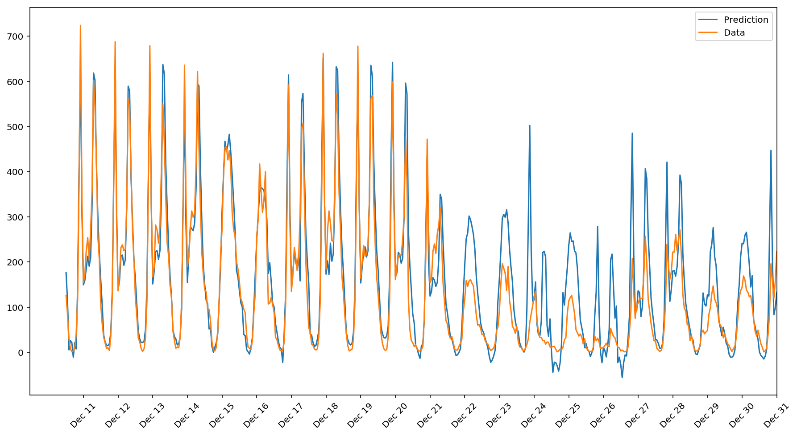

#  Predicting Bike Sharing Demand using Neural Network 

A neural network model is built and trained to predict bike sharing demand in Washington, DC. The model is a neural network with one hidden layer, written in Python using  Pandas and  NumPy. The training dataset contains the hourly and daily count of rental bikes in 2011 and 2012 in Capital bikeshare system with the corresponding weather and seasonal information. ([Link to dataset folder](https://github.com/rezadodge/deep_learning/tree/master/neural_networks/bike_sharing/Bike-Sharing-Dataset); [Link to the repository on UCI Machine Learning Database](http://archive.ics.uci.edu/ml/datasets/Bike+Sharing+Dataset))

###  Predictions for the last three weeks of the year 
The predictions are very good up to weekend before Christmas. The training data included only one Christmas (year 2011) so it is not surprising that the predictions are not very good for this week. 

